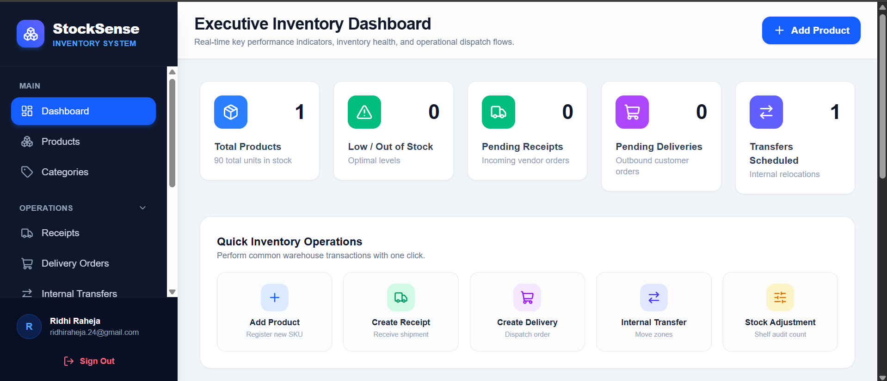
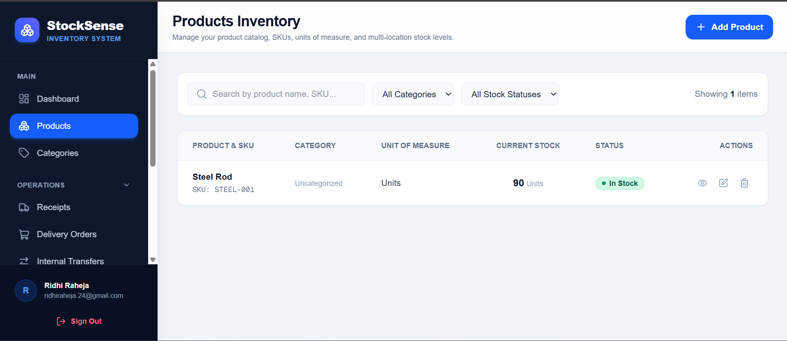
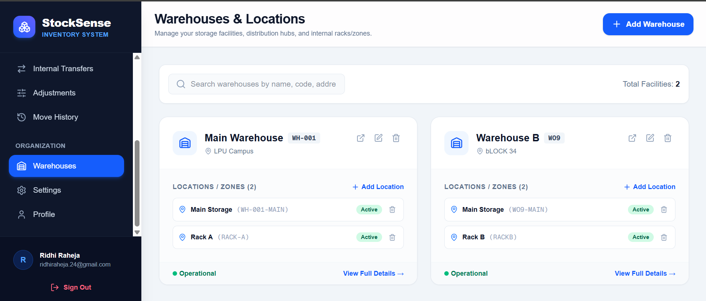
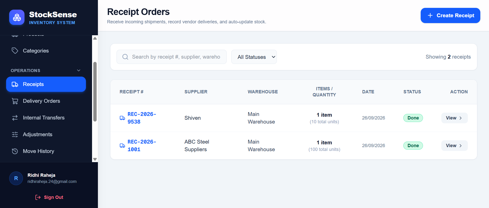
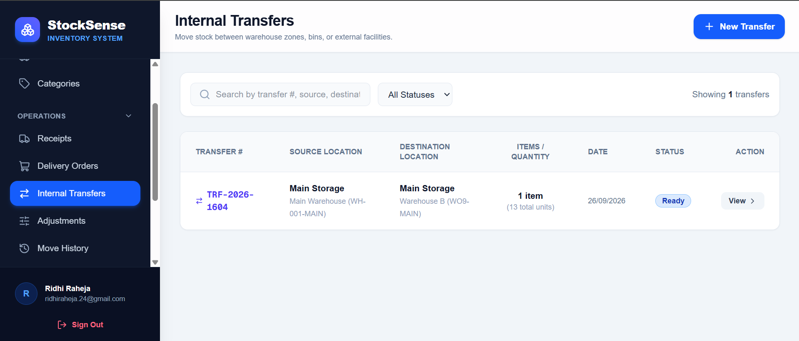
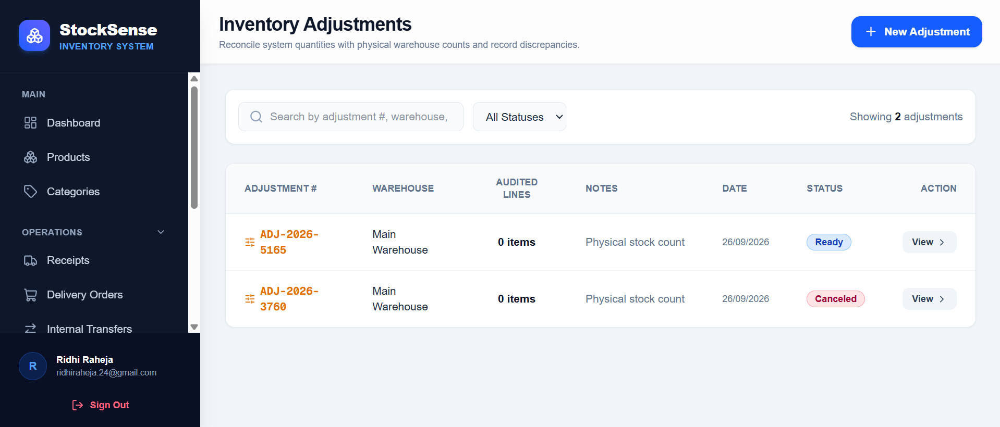
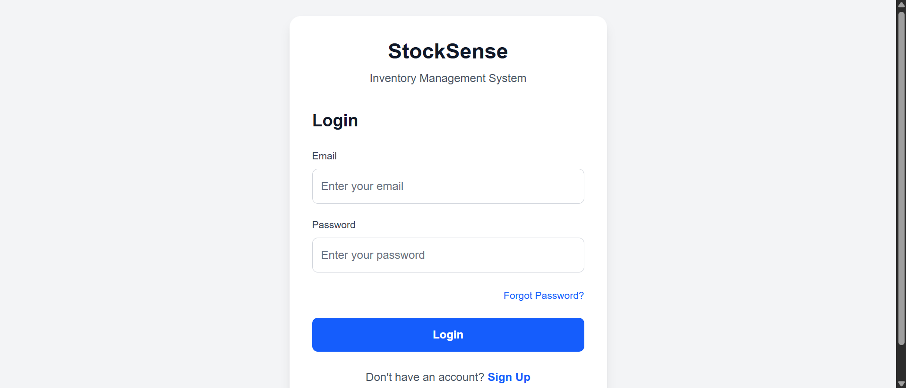

# StockSense

StockSense is an inventory and warehouse management app built with Next.js and Supabase. It tracks stock across multiple warehouses — what comes in, what moves between locations, what goes out — and gives you a dashboard to see where things stand without digging through spreadsheets.

App Link: https://stock-sense-six-puce.vercel.app/
Live Demo: https://drive.google.com/file/d/1yGRz9glTB7lrkOX8SawojMDL6yr1n3tK/view



## What it does

**Dashboard.** Total stock on hand, product count, low-stock warnings, and pending receipts, deliveries, and transfers, all in one place. You can filter by document type, status, warehouse, or category, and there's a feed of recent activity so you're not guessing what just happened.

**Products and categories.** Each product has a SKU, a unit of measure, a category, and an active/inactive flag. Reorder rules let you set a minimum quantity per product so the dashboard can flag it before you actually run out.

**Warehouses and locations.** Set up as many warehouses as you need, each with its own locations underneath it. Turn a warehouse or location off without deleting it if it's temporarily out of use.

**The four document types that move stock:**
- Receipts, for stock coming in from a supplier
- Deliveries, for stock going out to a customer
- Transfers, for moving stock between locations or warehouses
- Adjustments, for correcting counts after a physical stock check, with a reason attached (damaged, lost, found, count correction, other)

Every document goes through the same status flow — draft, waiting, ready, done, or canceled — and every unit that moves gets logged in a stock moves ledger you can audit later.

**Accounts.** Email and password login through Supabase Auth, with signup, forgot-password, and reset-password flows, plus a basic profile and settings page.

## Screenshots

| Dashboard | Products |
|---|---|
|  |  |

| Warehouses | Receipts |
|---|---|
|  |  |

| Transfers | Adjustments |
|---|---|
|  |  |

| Login |
|---|
|  |

## Built with

- Next.js 16 (App Router)
- React 19, Tailwind CSS 4
- Supabase for auth, Postgres, and a couple of RPC functions
- Recharts for the dashboard charts
- lucide-react for icons
- TypeScript throughout, deployed on Vercel

## Running it locally

You'll need Node 18+ and a Supabase project — the free tier is enough.

Clone the repo and install dependencies:

```bash
git clone https://github.com/ridhiraheja/StockSense.git
cd StockSense
npm install
```

Add a `.env.local` file with your Supabase credentials, found under Settings → API in your Supabase dashboard:

```bash
NEXT_PUBLIC_SUPABASE_URL=your-supabase-project-url
NEXT_PUBLIC_SUPABASE_PUBLISHABLE_KEY=your-supabase-anon-key
```

The app expects these tables to already exist in your Supabase project: `profiles`, `warehouses`, `locations`, `categories`, `products`, `stock_levels`, `reorder_rules`, `receipts`/`receipt_items`, `deliveries`/`delivery_items`, `transfers`/`transfer_items`, `adjustments`/`adjustment_items`, and `stock_moves`. It also calls two RPC functions, `get_total_stock` and `get_low_stock_count`. If you export your schema as SQL and drop it into `supabase/schema.sql`, link it here so other people can set up the database in one step instead of guessing at the structure.

Then run:

```bash
npm run dev
```

and open http://localhost:3000. It'll redirect you to `/login` or `/dashboard` depending on whether you're already signed in.

## Project layout

```
StockSense/
├── app/
│   ├── dashboard/          # KPIs and activity feed
│   ├── products/           # Product catalog
│   ├── categories/
│   ├── warehouses/         # Warehouses and their locations
│   ├── receipts/
│   ├── deliveries/
│   ├── transfers/
│   ├── adjustments/
│   ├── moves/              # Full stock movement ledger
│   ├── profile/
│   ├── settings/
│   ├── login/ signup/ forgot-password/ reset-password/
│   └── page.tsx            # Redirects to /login or /dashboard
├── components/              # AppLayout, StatCard, StatusBadge, Modal, EmptyState
├── lib/
│   ├── supabase/client.ts
│   └── types.ts             # Shared TypeScript types
└── public/
```

## What's next

Some things that aren't built yet but would make sense to add: barcode scanning, exportable CSV/PDF reports, role-based permissions so staff and admins see different things, supplier and customer records, and automatically generating purchase orders off the reorder rules.

## Contributing

Issues and pull requests are welcome — check the [issues page](https://github.com/ridhiraheja/StockSense/issues) if you want to help out.

